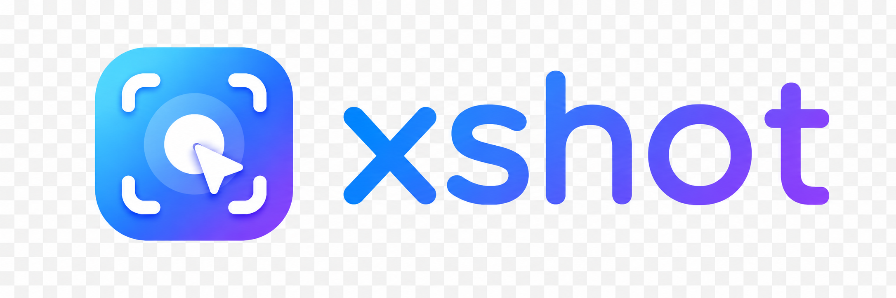
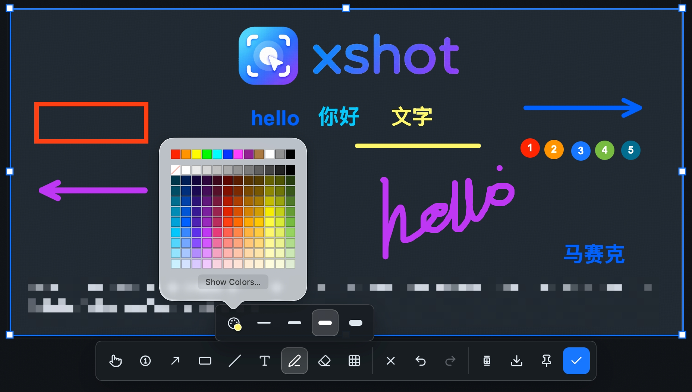

# xshot

<p align="center">
  <a href="./README.md">简体中文</a> |
  <a href="./README.en.md">English</a> |
  <a href="./README.zh-TW.md">繁體中文</a> |
  <a href="./README.ja.md">日本語</a> |
  <a href="./README.ko.md">한국어</a> |
  <a href="./README.es.md">Español</a> |
  <a href="./README.fr.md">Français</a> |
  <a href="./README.de.md">Deutsch</a> |
  <a href="./README.pt-BR.md">Português (Brasil)</a> |
  <a href="./README.ru.md">Русский</a>
</p>

<p align="center">
  
</p>

<p align="center">
  <strong>Un outil de capture d'écran de bureau léger, résident et pratique.</strong>
</p>

xshot est un outil de capture d'écran de bureau qui prend en charge la capture rapide, la sélection de fenêtre/région, les annotations, la capture défilante, le recadrage, l'épinglage à l'écran, la copie et l'enregistrement. Il est conçu pour être utilisé depuis la barre d'état système et un raccourci global.

## Documentation Multilingue

Le README en chinois simplifié est la source de référence de la documentation. Lorsque les descriptions de fonctionnalités, les notes d'installation, les limitations ou la feuille de route changent, mettez d'abord à jour `README.md`, puis synchronisez les versions English, 繁體中文, 日本語, 한국어, Español, Français, Deutsch, Português (Brasil) et Русский.

## Fonctionnalités Clés

- ✅ Prend en charge la capture défilante.
- ✅ Permet d'épingler les captures dans des fenêtres flottantes toujours au premier plan.
- ✅ Prend en charge l'OCR, la reconnaissance de QR codes, la traduction de texte et la superposition de traduction sur le texte d'origine.
- ✅ Prend en charge les outils d'annotation : marqueur numéroté, flèche, rectangle, ligne, texte, stylo, gomme et mosaïque par zone.
- ✅ Prend en charge la détection de fenêtre au survol : déplacez le curseur sur une fenêtre candidate et cliquez pour la sélectionner.



## Utilisation

Après son lancement, xshot fonctionne depuis la barre d'état système. Vous pouvez démarrer une capture ainsi :

- Appuyez sur le raccourci global par défaut `Option + X` / `Alt + X`.

## Permissions de Plateforme et Installation

- Si macOS indique que le développeur ne peut pas être vérifié, ouvrez `Réglages Système` -> `Confidentialité et sécurité`, puis choisissez `Ouvrir quand même`.
- Si l'application ne s'ouvre toujours pas, exécutez `xattr -dr com.apple.quarantine /Applications/xshot.app`, puis réessayez.
- Sur macOS, la première capture peut nécessiter l'autorisation d'enregistrement de l'écran ; il est recommandé de redémarrer l'application après l'avoir accordée.
- Sur macOS, la capture défilante nécessite l'autorisation d'accessibilité pour surveiller/filtrer les événements de molette et laisser la fenêtre sous la sélection recevoir le défilement.
- L'OCR repose sur macOS Vision ; la traduction nécessite un accès réseau et utilise Google Translate par défaut.
- Le réglage de l'icône du Dock est réservé à macOS.
- Le chemin de capture principal actuel ne traite que l'écran principal. La prise en charge multi-écrans est encore en cours d'amélioration.
- La détection de fenêtre au survol dépend de l'énumération des fenêtres système ; certaines fenêtres système, surcouches ou applications plein écran peuvent donc se comporter différemment.

## Réglages

- Raccourci : cliquez sur modifier, saisissez une nouvelle combinaison de touches et enregistrez pour l'appliquer immédiatement.
- Réinitialiser le raccourci : restaure `Option + X` / `Alt + X`.
- Icône du Dock : sous macOS, contrôle l'affichage de l'icône de l'application dans le Dock.
- Lancer à l'ouverture de session : démarre automatiquement xshot après la connexion.
- Emplacement d'enregistrement par défaut : les captures téléchargées sont d'abord enregistrées dans le dossier indiqué ; sinon, le dossier Downloads est utilisé.
- Langue de l'interface : prend actuellement en charge le chinois simplifié et English.
- Permissions : sous macOS, affiche l'état des autorisations d'enregistrement de l'écran et d'accessibilité, et ouvre directement le panneau correspondant des Réglages Système.

## Pipeline de Capture Actuel

- Au démarrage, l'application crée et masque le WebView de capture, puis réutilise cette fenêtre lorsqu'une capture démarre.
- Sur macOS, la capture classique utilise actuellement `screencapture -x -R <screenshot-window-rect>` du système ; le résultat est d'abord écrit dans un PNG temporaire, puis relu dans la couche d'édition frontend.
- Sur Windows / Linux, le chemin actuel capture l'écran via `xcap` et encode le PNG côté Rust.
- Sur macOS, la capture défilante rend la fenêtre de capture transparente à la souris et ne transmet que les événements de molette vers le bas. Chaque image tente d'abord de capturer le contenu sous la fenêtre de capture avec CoreGraphics `CGWindowListCreateImage`, puis revient à `screencapture -R` en cas d'échec.
- L'assemblage de capture longue ajoute uniquement les nouvelles lignes selon le décalage vertical réel entre deux images. Les petits déplacements ne mettent pas à jour l'image précédente, ce qui évite d'ajouter trop de contenu sur des textures répétées ou des fonds blancs.
- Une fois l'image longue générée, elle passe dans la vue de recadrage/édition ; copier et enregistrer exportent la zone de recadrage actuelle.
- L'épinglage écrit le PNG exporté dans un répertoire temporaire, puis crée une fenêtre Tauri indépendante, sans bordure, toujours au premier plan et visible sur tous les espaces pour afficher l'image.
- L'OCR utilise `VNRecognizeTextRequest` de macOS Vision, en privilégiant accurate puis en revenant à fast en cas d'échec ; la reconnaissance QR utilise `VNDetectBarcodesRequest`.
- La traduction est gérée par le backend Rust via Google Translate et prend en charge le proxy système. La superposition de traduction génère des annotations de texte éditables et annulables à partir des coordonnées OCR block ; un nouveau clic supprime la superposition générée.
- Le flux de capture conserve des journaux de durée par étape afin d'identifier la latence du raccourci, de la capture, du décodage d'image et de l'affichage de la fenêtre.
- ScreenCaptureKit a été testé auparavant, mais la qualité et le gain n'étaient pas suffisants ; le chemin principal conserve donc le fallback stable.

## Développement

Prérequis Tauri : <https://v2.tauri.app/start/prerequisites/>

Prérequis :

- Node.js
- pnpm
- Rust
- Dépendances système de Tauri v2

Commandes utiles :

```bash
pnpm install       # Installer les dépendances
pnpm dev           # Démarrer l'environnement de développement Tauri
pnpm dev:web       # Démarrer uniquement le frontend Vite
pnpm build:web     # Construire le frontend
pnpm build         # Construire l'application de bureau
pnpm tsc           # Vérification TypeScript
pnpm format        # Prettier + cargo fmt
```

Structure du projet :

```text
src/                    Frontend React
src/windows/            Fenêtre de capture
src/logic/              Réglages, raccourcis, curseur et logique frontend
src-tauri/              Backend Tauri / Rust
src-tauri/src/lib.rs    Capture, barre d'état, presse-papiers, enregistrement des commandes de fenêtre
src-tauri/src/ocr.rs    OCR macOS Vision / reconnaissance QR
src-tauri/src/translation.rs  Service de traduction
public/                 Ressources d'images de l'application
```

## Limitations Actuelles

- La prise en charge multi-écrans reste incomplète.
- La capture défilante est actuellement prioritaire sur macOS et dépend des autorisations d'enregistrement de l'écran et d'accessibilité ; elle ne prend pour l'instant en charge que l'assemblage vers le bas.
- L'OCR est actuellement prioritaire sur macOS ; la traduction dépend du réseau et de la disponibilité de Google Translate.
- Les modifications de propriétés d'annotation sont appliquées immédiatement, mais ne sont pas encore suivies comme actions autonomes dans la pile d'annulation.
- Les réglages avancés tels que le choix du format d'image, les paramètres de lancement et la personnalisation de la barre d'outils ne sont pas encore exposés.
- La capture de fenêtre dépend de la détection de fenêtres candidates ; de rares fenêtres transparentes, surcouches système ou espaces plein écran peuvent ne pas être correctement ciblés.

## Feuille de Route

- Compléter la capture multi-écrans et la correspondance des coordonnées.
- Ajouter des réglages de format et de qualité d'image.
- Intégrer les modifications de propriétés d'annotation dans une pile undo/redo plus complète.
- Prendre en charge davantage de styles d'annotation et de configuration de barre d'outils.
- Améliorer les paquets d'installation, le flux de publication et la validation de compatibilité des plateformes.

## Stack Technique

- Tauri v2
- React 19
- TypeScript
- Vite
- Fabric.js
- lucide-react
- i18next / react-i18next
- xcap / image
- Tauri autostart / dialog / global-shortcut / clipboard-manager / opener plugins
- ai-ins Vite plugin
